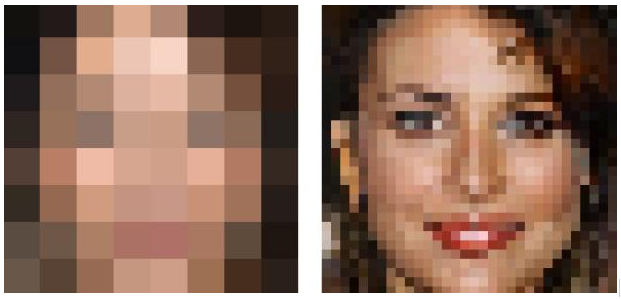

# Project: Can you unscramble a blurry image? 


### [Full Project Description](doc/project3_desc.md)


+ Project summary: In this project, I created a classification engine for enhance the resolution of images. I have achieved three things in this project: 
1. Implemented the current practice as the baseline model. 
2. Implemented an improvement to the current practice. In this part, I chose two different models as improvements: Xgboost and Neural Network. 
3. Evaluated the performance gain of our proposed improvement against the baseline. 
    
+ Specifically, in feature selection part, I implemented Laplace transformation to training pictures, in order to find the most representaive points in each picture and sampled them as our training data points. Then after building models using training data, through cross validation for each model (mentioned above), I got the best parameters for each model according to the cross validation error, then implemented each model with their best parameters on testing pictures.
Finally, according to the PSNR value of each model, I decided which model is the best model in super resolution problem.


Following [suggestions](http://nicercode.github.io/blog/2013-04-05-projects/) by [RICH FITZJOHN](http://nicercode.github.io/about/#Team) (@richfitz). This folder is orgarnized as follows.

```
proj/
├── lib/
├── data/
├── doc/
├── figs/
└── output/
```

Please see each subfolder for a README file.
